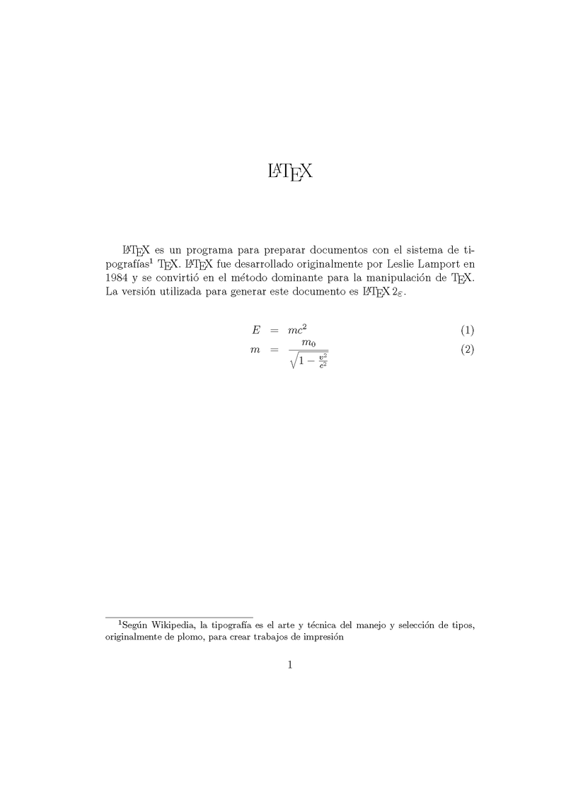

# LaTex
## Documentos creados en latex

### ¿Que es LaTex?

Es un sistema de composición de textos, orientado a la creación de documentos escritos que presenten una alta calidad tipográfica. Por sus características y posibilidades, es usado de forma especialmente intensa en la generación de artículos y libros científicos que incluyen, entre otros elementos, expresiones matemáticas.

LaTeX está formado por un gran conjunto de macros de TeX, escrito por Leslie Lamport en 1984, con la intención de facilitar el uso del lenguaje de composición tipográfica TEX, creado por Donald Knuth. Es muy utilizado para la composición de artículos académicos, tesis y libros técnicos, dado que la calidad tipográfica de los documentos realizados en LaTeX, se considera adecuada a las necesidades de una editorial científica de primera línea, muchas de las cuales ya lo emplean.
***

### Objetivos

El objetivo de este repositorio es que el usuario aprenda las bases de LaTex para la creación de documentos de tipo informes, profesionales y formales teniendo a su disponibilidad en este repositorio archivos para su inicio en este sistema

***
### Ejemplo
#### Codigo

``` LaTex
\documentclass[12pt]{article}
\usepackage[spanish]{babel}
\usepackage{amsmath}
\title{\LaTeX}
\date{}
% Este es un comentario, no será mostrado en el documento final.
\begin{document}
\maketitle
\LaTeX{} es un programa para preparar documentos con  el sistema de
tipograf\'ias\footnote{%nota al pie de página Seg\'un Wikipedia, la 
tipograf\'ia es el arte y t\'ecnica del manejo y selecci\'on de tipos, 
originalmente de plomo, para crear trabajos de impresi\'on } %fin nota al pie de página
\TeX{}. \LaTeX{} fue desarrollado originalmente por Leslie Lamport en 
1984 y se convirti\'o en el m\'etodo dominante para la  manipulaci\'on 
de \TeX. La versi\'on utilizada para generar  este documento es \LaTeXe.
\newline
% El siguiente código muestra la calidad de la tipografía de LaTeX
\begin{align}
E &= mc^2                              \\
m &= \frac{m_0}{\sqrt{1-\frac{v^2}{c^2}}}
\end{align}
\end{document}
```
***
#### Resultado


***
## **METR1CKA**

> [Pagina web](https://metr1cka.github.io "Visitanos")

> [Mas repositorios](https://github.com/METR1CKA "Mi perfil")
